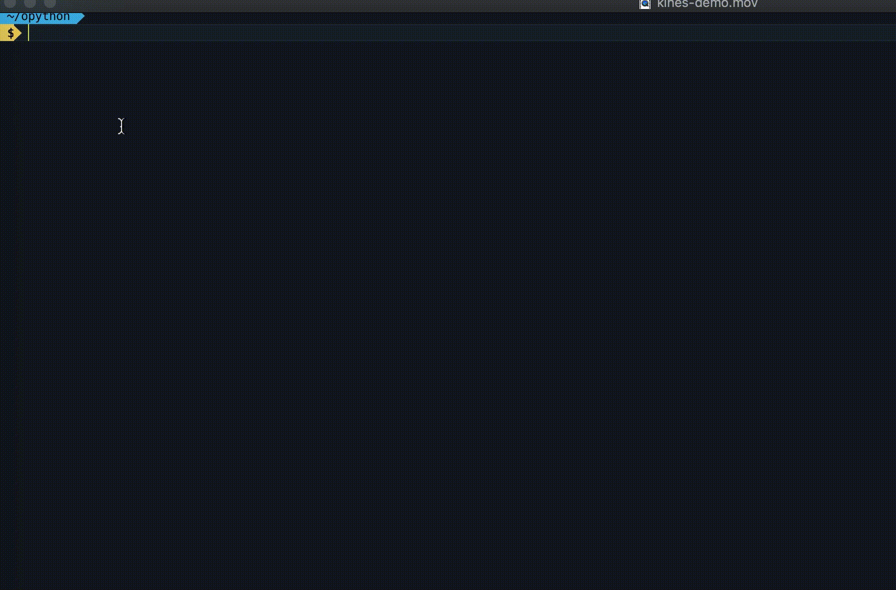

## Kines
Friendly Amazon Kinesis Stream Command Line Interface

#### Install
- `pip install kines`

#### Setup 
- `aws configure`

#### Commands 
##### List all Kinesis Stream
- `kines ls`

##### List Kinesis Stream Shards
- `kines lss <stream-name>`
- For detailed output Run `kines lss <stream-name> -d`

##### Find shard for partition key
- `kines find prod-clickstream -p 123455 -p 8900`

#### Get report for your Kinesis Stream
- `kines report <stream-name> -h <number-of-hours> -p <metric-period-in-minutes>`

#### View all short forms and legends
- `kines legends`

#### How to build in Dev?
- `pip install --editable .`

#### How to publish to pypi?
- `python3 setup.py sdist bdist_wheel`
- `twine upload --skip-existing dist/*`
